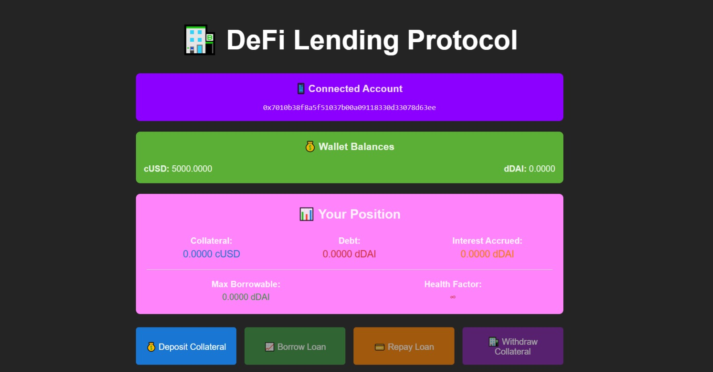

# DeFi Lending Protocol - DApp

Protocolo de préstamos descentralizados que permite a los usuarios depositar colateral (cUSD) y obtener préstamos (dDAI) con un ratio de colateralización del 150% e interés fijo del 5%.

## Contratos Principales:
1. **CollateralToken.sol** - Token ERC20 para colateral (cUSD)
2. **LoanToken.sol** - Token ERC20 para préstamos (dDAI)
3. **LendingProtocol.sol** - Contrato principal del protocolo

## Pre-Requisitos
- [Node.js](https://nodejs.org/) 
- [npm](https://www.npmjs.com/) 
- [MetaMask](https://metamask.io/) browser extension
    - Agregar red con RPC: https://otter.bordel.wtf/erigon
    - Network ID: 39438147
- [Test ETH on Ephemery Testnet](https://github.com/ephemery-testnet/ephemery-resources)
    - Utilizar Faucet: https://ephemery-faucet.pk910.de/

## Pasos a seguir

### 1. Instalar HardHat y dependencias relacionadas:
```bash
npm install --save-dev hardhat @nomicfoundation/hardhat-toolbox 
npm install ethers@6.14.3
npm install react vite dotenv
npm install --save-dev solidity-coverage
npm install @openzeppelin/contracts@4.9.3
```

### 2. Configurar variables de entorno en proyecto/.env y proyecto/web_app/.env:
```bash
PRIVATE_KEY=PRIVATE_KEY_DE_TU_CUENTA
VITE_USER_ADDRESS=ADDRESS_DE_TU_CUENTA
VITE_RPC_URL=https://otter.bordel.wtf/erigon
VITE_CONTRACT_ADDRESS=CONTRACT_ADDRESS # Se obtendrá al desplegar el contrato
VITE_DDAI_ADDRESS=DDAI_ADDRESS # Se obtendrá al desplegar el contrato
VITE_CUSD_ADDRESS=CUSD_ADDRESS # Se obtendrá al desplegar el contrato
```
### 3. Compilar, testear y desplegar
```bash
npx hardhat compile
npx hardhat test
npx hardhat run scripts/deploy.js --network ephemery # Aquí obtendrás los address faltantes para tus .env
```
Completa las variables de entorno faltantes en proyecto/.env y proyecto/web_app/.env

### 4. Cargar el contrato y el usuario con tokens necesarios.
```bash
npx hardhat run scripts/fund.js --network ephemery
```

## Contratos Desplegados en Ephemery Testnet

### Direcciones de Contratos:
- **CollateralToken (cUSD)**: `0x66b1e739153376539f4FC5BCD6d1fF5B0aa34831`
- **LoanToken (dDAI)**: `0x51E26Cd63A713310533Ac5fF5fe72503d22B6f5c`
- **LendingProtocol**: `0xD43Fe680CC6DD31473720DeF45C667821a0152DC`

### Ejecutar Tests:
```bash
npm test
npm run coverage
```

### Ejecutar Frontend:
```bash
cd web_app
npm install
npm run dev
```
Ingresando a http://localhost:5173 y conectándote con tu billetera visualizarás algo como:


---
*Realizado por: Abigail Mercedes Nuñez Fernandez y Jonathan Sebastian Godoy Silva.*